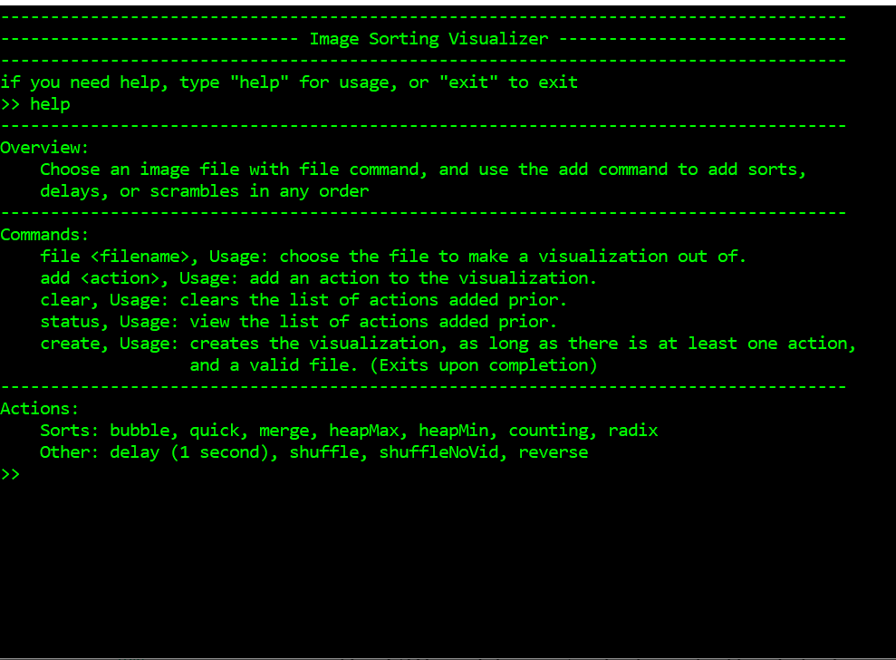
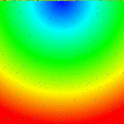

# sortingVisualizer

Sorting Alogorithms:
>bubble sort  
>merge sort  
>quick sort  
>heap sort (min and max)  
>counting sort  
>radix sort (base 10)  
  

A command line tool to create .mp4 videos, visualizing different sorting algorithms.  
These visualizations are of given images having their pixels shuffled and then sorted back together.  
This was done with the help of stb_image to import images, and ffmpeg to encode them.
This program works best with small images, as it sorts by position, so the size of the array being sorted is the length x width.   

here is an example output of the program done with radix base 10  
(it was converted from mp4 to gif, so it could be shown in markdown, so there is a slight decrease in quality)  
  

Thanks to Dmytro Dovzhenko for his help, with the VideoCapture class.
